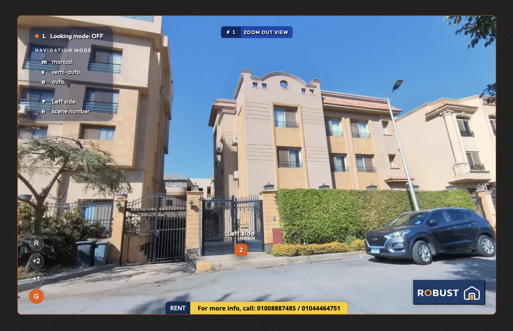

# Robust Virtual Tour Builder


<!-- METADATA_START -->
**Version:** 5.3.6 (Build 68)  
**Release Date:** March 20, 2026  
**Status:** Stable `main` ships the local-first builder runtime  
**License:** AGPL v3 + optional commercial license
<!-- METADATA_END -->

Robust Virtual Tour Builder is an open source virtual-tour authoring platform built with ReScript and Rust.

It is designed for a practical local-first workflow:
- run the **builder locally** to author and manage tours
- publish to a **portal/customer delivery surface** for sharing and access workflows

The stable adopter path is the `main` branch.

## At A Glance

| Surface | Purpose | Typical Host |
|---|---|---|
| **Builder** | Author scenes, hotspots, floors, labels, exports, and project state | Local machine by default |
| **Portal** | Deliver published tours, customer access, and broker-facing sharing workflows | VPS / hosted environment |

Quick links:
- [Stable setup](#stable-setup)
- [Runtime config](#runtime-config)
- [Documentation map](#documentation-map)
- [Development workflow](#development-workflow)
- [License](#license)

## Why This Project

- **Local-first editing:** keep working project state on your machine by default
- **Single-server stable runtime:** the stable builder path now serves UI and API from one origin
- **Structured authoring model:** scenes, floors, hotspots, traversal, and publishing are all part of one workflow
- **Portal-ready delivery:** published tours can feed a hosted customer-facing delivery surface
- **Typed architecture:** ReScript frontend and Rust backend reduce whole classes of runtime mistakes

## Who This Is For

This project is especially suited for:
- **freelance real estate brokers** who want to create web-based virtual tours for their customers
- solo operators who prefer to keep authoring local, instead of relying on a heavy hosted editor
- brokers who also want to generate promotional motion content from the same tour project

The practical use case is:
- shoot 360 photos, for example with an **Insta360** workflow
- build and direct the tour locally
- export a tour package for portal delivery
- generate promotional **WebM** teaser/video content from the same material

## Live Demo

Demo tour preview:

[](https://www.robust-vtb.com/u/ak84/tour/demotourtripz)

Temporary public demo link:
- [https://www.robust-vtb.com/u/ak84/tour/demotourtripz](https://www.robust-vtb.com/u/ak84/tour/demotourtripz)

Note:
- this demo link is public for evaluation only and may stop working after a limited time
- direct contact for demo questions: `+201005684094`

## Stable Setup

Use this if you want the repo to behave like the product, not like a dev sandbox.

### First Run

Clone the repo and stay on `main`, then run the setup script for your OS.

macOS / Linux:

```bash
./scripts/setup-local-builder.sh
```

Windows PowerShell:

```powershell
./scripts/setup-local-builder.ps1
```

What this does:
- installs missing local prerequisites through the supported package manager when possible
- generates `config/builder.runtime.toml` with ready-to-run defaults
- generates `backend/.env.local-builder` with local secrets if needed
- builds the frontend and backend for production
- starts the builder as a **single server** on one host and port

Open:

```text
http://127.0.0.1:8080
```

### Daily Start

After first setup:

```bash
npm run start
```

Stable launcher behavior:
- expects the repo to run from `main`
- auto-switches to `main` only when the worktree is clean
- stops with guidance if branch switching would affect uncommitted work
- preserves incremental backend release builds
- serves both the UI and API from the same origin

### Runtime Config

Stable runtime settings live in:
- `config/builder.runtime.toml`
- `backend/.env.local-builder`

Default generated runtime config:

```toml
[app]
surface = "builder"
profile = "local"

[server]
host = "127.0.0.1"
port = 8080

[public]
base_url = "http://127.0.0.1:8080"
```

For VPS-oriented builder hosting, edit:
- `profile`
- `host`
- `port`
- `base_url`

When `profile = "vps"` and no owner account exists yet, the launcher prints a one-time setup URL for the first admin.

### Local Recovery

On local installs:
- visit `/local-reset` to restart first-time setup
- auth-only reset preserves local projects by default
- full reset is opt-in and wipes local project data

Full setup details: [docs/operations/local-builder-setup.md](docs/operations/local-builder-setup.md)

## What The App Does

### Builder
- import panoramic scenes and project packages
- manage scenes, floors, labels, hotspots, traversal, and tagging
- export self-contained tours
- support teaser/video workflows and publish-ready packaging

### Portal
- host published tours for customer-facing delivery
- manage portal admin workflows for tours, recipients, and assignments
- serve customer/gallery surfaces for delivered tours

### Reliability Layer
- track long-running operations through a unified lifecycle
- preserve local state with recovery-oriented persistence
- supervise navigation with structured cancellation and retry semantics
- support first-run setup and local auth reset flows

## Minimal Workflow

```text
Shoot 360 photos (e.g. Insta360)
        ↓
Upload scenes into the local builder
        ↓
Organize floors / scenes / labels
        ↓
Direct the virtual tour with hotspots and traversal
        ↓
Export tour ZIP package
        ↓
Upload published tour later to the portal
        ↓
Deliver web-based tour to customers
```

Optional parallel output:

```text
Same tour project
        ↓
Run teaser / video workflow
        ↓
Generate promotional WebM content
```

## Current Feature Areas

- **Scene authoring:** floor-aware scene organization, hotspot editing, linking, labeling, and traversal logic
- **Viewer runtime:** dual-viewer transition architecture, hotspot overlays, navigation feedback, and simulation support
- **Project IO:** local persistence, dashboard reopen flows, package import/export, and resumable upload pathways
- **Publishing:** portal library workflows, customer delivery, and export packaging
- **Media tooling:** image processing, EXIF analysis, thumbnails, geocoding support, FFmpeg-backed teaser/video paths
- **Ops/security:** auth flows, rate limiting, session handling, release guards, and health endpoints

## Architecture Snapshot

Core stack:
- **Frontend:** ReScript v12, React 19, Rsbuild, Tailwind CSS 4
- **Backend:** Rust, Actix-web, SQLx, SQLite
- **Testing:** Vitest and Playwright

Core patterns:
- centralized reducer architecture on the frontend
- FSM-driven navigation and application lifecycle
- dual-viewer scene transition system
- local-first persistence and recovery layers
- service-oriented Rust backend with portal, project, media, and auth boundaries

Key references:
- [MAP.md](MAP.md)
- [DATA_FLOW.md](DATA_FLOW.md)
- [docs/architecture/overview.md](docs/architecture/overview.md)
- [docs/project/mechanics.md](docs/project/mechanics.md)

## Recommended Product Shape

For most adopters, the practical setup is:
- run the **builder locally**
- host the **portal remotely**
- keep editable project state local
- use publishing/export to move finished tours into hosted delivery

The repo also supports VPS-oriented builder hosting through runtime config, but the local-first builder remains the default recommendation.

## Documentation Map

Start here depending on intent:
- **Stable setup / hosting:** [docs/operations/local-builder-setup.md](docs/operations/local-builder-setup.md), [docs/operations/deployment.md](docs/operations/deployment.md)
- **Architecture:** [docs/architecture/INDEX.md](docs/architecture/INDEX.md)
- **Project behavior:** [docs/project/INDEX.md](docs/project/INDEX.md)
- **Security / auth / licensing:** [docs/security/INDEX.md](docs/security/INDEX.md)
- **API reference:** [docs/api/INDEX.md](docs/api/INDEX.md)
- **Docs root:** [docs/INDEX.md](docs/INDEX.md)

## Development Workflow

Use this only if you are actively developing the app itself.

Setup:

```bash
./scripts/setup.sh
```

Start the full dev stack:

```bash
npm run dev
```

Open:

```text
http://localhost:3000
```

Useful commands:

```bash
npm run dev:frontend
npm run dev:backend
npm run res:watch
npm run sw:watch
npm run build
npm test
```

## License

This project uses a dual-license model:
- **AGPL v3** for users comfortable with AGPL compliance
- **Commercial terms** for proprietary or separately contracted use

Start here:
- [docs/security/licensing.md](docs/security/licensing.md)
- [LICENSE](LICENSE)
- [LICENSE_COMMERCIAL](LICENSE_COMMERCIAL)

## Contact

Maintained by **Arto Kalishian**, the original developer of Robust Virtual Tour Builder.

- Email: `arto.eg@gmail.com`
- Website: `https://www.robust-vtb.com`
- GitHub Issues: use the repo issue tracker for bugs and setup problems
- Commercial / implementation inquiries: contact directly by email
