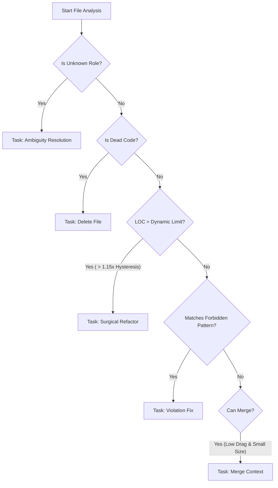

# 🏗️ System Architecture: _dev-system

The `_dev-system` is an **AI-Native Governance Engine** written in Rust. It acts as an autonomous "Architectural Supervisor" that continuously monitors the codebase, enforcing constraints that optimize it for AI Agents (LLMs) rather than just human developers.

---

## 🧩 High-Level System Design

The system operates as a **Loop** (Feedback Control System):

```
┌─────────────────┐       ┌──────────────────┐       ┌─────────────────┐
│  Codebase Change│──────►│  Watcher Script  │──────►│  Rust Analyzer  │
└─────────────────┘       │ (dev-system.sh)  │       │ (System Kernel) │
                          └──────────────────┘       └────────┬────────┘
                                                              │
          ┌───────────────────────────────────────────────────┘
          ▼
┌─────────────────┐       ┌──────────────────┐       ┌─────────────────┐
│  Semantic Scan  │──────►│   Graph Build    │──────►│ Task Synthesis  │
│ (AST & Metrics) │       │(Dead Code/Deps)  │       │ (Plan Generation│
└─────────────────┘       └──────────────────┘       └────────┬────────┘
                                                              │
          ┌◄──────────────────────────────────────────────────┘
          ▼
┌─────────────────┐       ┌──────────────────┐
│  Markdown Tasks │◄──────│    Agent Actions │
│ (tasks/pending) │       │ (Refactor/Merge) │
└─────────────────┘       └──────────────────┘
```

---

## 🧠 The Semantic Pipeline (Internal Logic)

The Rust Kernel (`analyzer`) processes the codebase in **4 Distinct Phases**:

### Phase 1: Discovery & Taxonomy
*   **Input**: `scanned_roots` from `efficiency.json`.
*   **Process**:
    1.  **Walk**: Recursive directory traversal.
    2.  **Driver Dispatch**: Selects language driver (`rust`, `rescript`, `js`, `css`).
    3.  **AST Parsing**: Parses code to extract "Rich Metrics" (not just LOC).
        *   *Nesting Depth*: How deep are `if/loop` structures?
        *   *Logic Density*: Ratio of logic to lines.
        *   *State Count*: Number of mutable variables.
    4.  **Taxonomy Inference**: Assigns a "Role" (e.g., `orchestrator`, `ui-component`, `domain-logic`) based on file path and content.

### Phase 2: Graph Construction
*   **Input**: Dependency lists from Phase 1.
*   **Process**:
    1.  **Resolver**: Resolves string imports (e.g., `import User`) to physical file paths.
    2.  **Dependency Graph**: Builds a directed graph of all modules.
    3.  **Entry Point Analysis**: Identifies "Roots" (Main.res, protected patterns).
    4.  **Reachability**: Traverses graph to find **Dead Code** (Unreachable islands).

### Phase 3: The Mathematical Engine (Drag & Limits)
This is the core differentiator. Instead of a static LOC limit, the system calculates a **Dynamic Limit** for *each file*.

#### 📉 The Drag Formula
**Drag** represents the "Cognitive Resistance" of a file.
```math
Drag = (1.0 + (Nesting * 0.5) + (Density * 1.2) + (State * 6.0)) * FailurePenalty
```
*   **Nesting**: High penalty. Deeply nested code is hard for LLMs to simulate.
*   **State**: Massive penalty. Mutable state causes "Context Fog".
*   **FailurePenalty**: If an agent recently failed to edit this file, Drag increases automatically.

#### 📏 The Dynamic Limit Formula
Defines the maximum safe size (LOC) for a specific file.
```math
Limit = (BaseLimit * RoleMultiplier * CohesionBonus) / Drag^0.75
```
*   **Result**: A complex, state-heavy file might have a limit of **150 LOC**, while a flat DTO file might have a limit of **600 LOC**.

### Phase 4: Task Synthesis (Decision Tree)
The system compares `Current State` vs `Optimal State` and generates discrete tasks.



---

## 📂 Directory Structure of `_dev-system`

```
_dev-system/
├── analyzer/           # 🦀 The Rust Core
│   ├── src/
│   │   ├── main.rs     # Pipeline Orchestrator
│   │   ├── drivers/    # Language Parsers (Rust, ReScript, JS)
│   │   ├── graph/      # Dependency Graph Logic
│   │   └── guard.rs    # File System & Task IO
│   └── Cargo.toml
├── config/
│   └── efficiency.json # ⚙️ The Brain (Weights, Roles, Rules)
└── README.md
```

## 🤖 Integration with Agents

1.  **Context Loading**: Agents read `MAP.md` to understand the system map.
2.  **Task Pickup**: Agents look in `tasks/pending/`.
3.  **Task Execution**:
    *   **Surgical**: Agent splits a big file into smaller files.
    *   **Merge**: Agent combines small files into one.
4.  **Verification**: Agent runs `./scripts/project-guard.sh` or waits for the watcher to remove the task.

## 🛡️ Stability Mechanisms

*   **Hysteresis**:
    *   **Split Trigger**: `Limit * 1.15` (Prevents splitting just because you added 1 line).
    *   **Merge Safety**: Only merge if result is `< Limit * 0.85`.
*   **Conflict Locking**:
    *   A file marked for "Surgical Refactor" is **locked** from being merged.
*   **Shadow Protection**:
    *   Prevents merging a sub-folder (e.g., `auth/`) if a parent file (`auth.rs`) exists, preserving the "Orchestrator Pattern".

---
*Generated by Gemini CLI - v1.5.0 Analysis*
