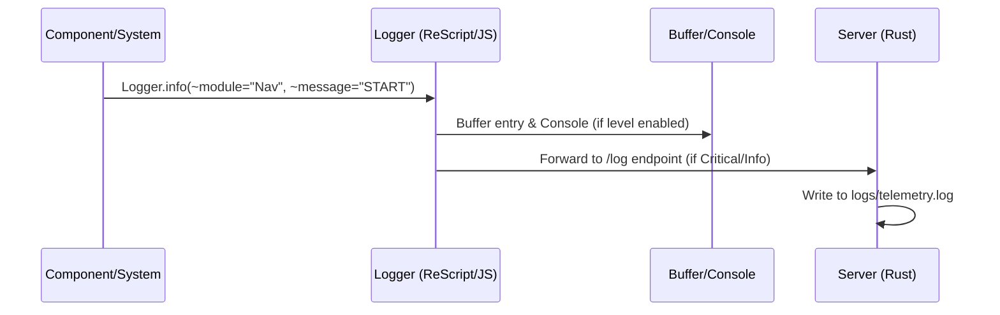

# Project Standards & Workflows Reference (Automated)

## 🏗️ The Development Lifecycle (Updated)
The system now uses **Active Enforcement** via shell scripts.

1. **Start Session**: Run `./scripts/ensure-watcher.sh` (or let the AI run it automatically).
2. **Develop**: Modify code. `fswatch` captures snapshots automatically to `local-snapshots/<branch>`.
3. **Commit**: NEVER use `git commit`. Run `./scripts/commit.sh "message"`.
4. **Push**: `git push` triggers the `pre-push` hook automatically.

---

## 🤖 Automated Workflows

### 📸 Shadow Branch (Dev Mode)
- **Script**: `scripts/dev-mode.sh`
- **Behavior**: Watches `./src` and `./backend`. Creates hidden commits on a shadow branch on every file save.
- **Rollback**: To see past state, use `git log local-snapshots/develop`.

### 📦 Commit Workflow (The Automator)
- **Script**: `scripts/commit.sh`
- **Trigger**: Run manually when feature is done.
- **Automated Steps**:
  1. **Preference Guard**: Greps for `console.log`, `innerHTML`, etc. Fails if found.
  2. **Context Refresh**: Maps file tree to `.agent/current_file_structure.md`.
  3. **Versioning**: Auto-increments Patch version & Updates `index.html?v=X`.
  4. **Build**: Runs `npm run res:build`.
  5. **Commit**: Commits to current branch.

### 🚀 Pre-Push Workflow (The Gatekeeper)
- **Script**: `.git/hooks/pre-push`
- **Trigger**: Automatic on `git push`.
- **Automated Steps**:
  1. **Backend**: Runs `cargo test` (Backend integrity).
  2. **Audit**: Checks for files > 1MB.
  3. **Cleanup**: Removes `telemetry.log`.

---

## 🚀 Branching & Release Strategy

We strictly separate active development from stable releases:

- **`develop` Branch**: The "living" branch where all active features and bugfixes are merged.
  - **Version Suffix**: All commits on this branch must use the `-beta` version suffix (e.g., `v4.1.2-beta`).
- **`main` Branch**: Reserved for production-ready, stable releases.
- **Release Process**: 
  - We commit often locally using the **Commit Workflow**.
  - We push to GitHub only on major updates (Y increment) or critical fixes.
  - Merging to `main` occurs only after a full system verification and user approval.

---

## 🤖 AI Collaboration & Safety

As an agentic AI assistant, I adhere to the following communication and safety protocols:

### Communication Style
- **Explanatory**: When code is changed, I will explain the *reasoning* and the *impact* on the system.
- **Proactive**: If I detect potential security flaws, performance bottlenecks, or architectural debt, I will report it immediately.
- **Incremental**: I favor small, verified steps over "big bang" refactors.

### Safety & Destructive Actions
- **Confirm Before Deleting**: I will never delete code files or perform major refactors without explicit user confirmation.
- **Build Integrity**: I will prioritize fixing the build over adding new features.
- **Sanitization**: I will always ensure inputs are sanitized (e.g., using `textContent` over `innerHTML`).

---

## 1. Core Principles & Philosophy

### 🎯 Philosophy
- **Stability First**: Robustness over speed. Type safety via ReScript is mandatory.
- **Premium UX**: High-quality typography (**Outfit** for headings, **Inter** for UI), glassmorphism, smooth transitions, and micro-interactions.
- **Incrementalism**: Small, verified steps. No "big bang" refactors without approval.
- **Immutability**: Favor immutable data structures and pure functions.

### 🎨 Design & Aesthetics
- **Styling**: Vanilla CSS only (using variables from `index.css`).
- **Feel**: The app must feel "expensive" and responsive.
- **Feedback**: Operations > 250ms **MUST** show progress bars with phase labels.
- **Performance**: Maintain 60fps; avoid blocking the main thread.

---

## 2. Functional Programming Standards

We enforce a functional paradigm across both ReScript and Rust.

### Universal Principles
- **Result/Option over Exceptions**: Handle errors as values. No `panic!` (Rust) or `Js.Exn.raise` (ReScript) in business logic.
- **Pure Functions**: Isolate side effects to the edges (React Hooks, Event Handlers, API Handlers).
- **No Nulls**: Explicitly use `Option` types.

### ReScript Frontend
- **State Management**: Centralized single source of truth in `src/store.res` (or `store.js`). Updates via Actions/Reducers.
- **Variants over Strings**: Use Variant types for state machines and data categories.
- **No Mutables**: Avoid `ref` and `mutable` fields; pass state as arguments.

---

## 3. Architecture & Security

### 🏗️ Modular Architecture
- **State**: Single Source of Truth in `src/store.js` / `src/store.res`. No private silos for global data.
- **Separation**: 
  - `src/components/`: Pure UI components and React layout.
  - `src/systems/`: Core business logic, managers, and orchestrators.
- **Constants**: Magic numbers and strings **MUST** be extracted to `src/constants.js`.

### 🔐 Security & Stability
- **Sanitization**: Use `textContent` instead of `innerHTML`. 
- **Path Safety**: Prevent directory traversal (e.g., `../`) in file/resource paths.
- **Resource Management**: Use `BlobManager` for object URL cleanup to prevent memory leaks.
- **Validation**: Strict MIME type and size validation for all file uploads.
- **Graceful Failure**: Implement Error Boundaries in the UI; never expose internal stack traces to the user.

---

## 4. Logging & Observability

**Strict Rule**: `console.log` is forbidden in committed code.

### The Logging Ecosystem

### Log Levels
| Level | Usage | Visibility |
| :--- | :--- | :--- |
| `trace` | High-frequency (frames/ticks) | Hidden |
| `debug` | Internal step-by-step flow | Hidden |
| `info` | Major lifecycle events | Visible in Console |
| `warn` | Soft failures / performance | Visible in Console |
| `error` | Critical failures | Always logged & forwarded |
| `perf` | Timing data | Logged if > threshold |

---

## 🔧 Troubleshooting Cheat Sheet

- **Toggle Debug Mode**: `Ctrl+Shift+D` inside the browser.
- **Console Commands**:
  - `DEBUG.enable()`: Show logs in console.
  - `DEBUG.setLevel('debug')`: Increase verbosity.
  - `DEBUG.downloadLog()`: Export session logs to JSON.
- **Files**:
  - `logs/error.log`: Quick check for recent crashes.
  - `logs/log_changes.txt`: Project history.

---

### 📼 Recovery Workflow (Time Machine)
- **Goal**: Granular rollback without altering git history.
- **Manual**: Run `./scripts/restore-snapshot.sh` for the interactive menu.
- **AI Assisted**: Ask "Rollback". The AI will perform a forensic analysis of file changes and execute the restore script for you.
