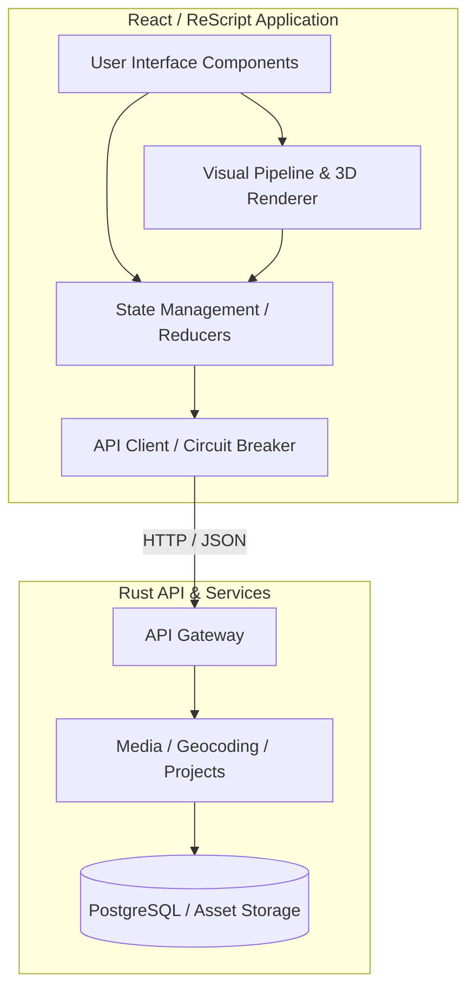

# Architecture Overview

## 📌 Anchor-Based Positioning Standards
**Objective**: Ensure hotspots and UI overlays remain visually pinned to their panoramic coordinates regardless of the user's zoom level or viewport size.

### Core Principles
1.  **3D to 2D Projection**: All screen coordinates are derived from 3D (Yaw/Pitch) values using the `ProjectionMath.res` module.
2.  **Normalized Coordinates**: Hotspot positions are stored as normalized Yaw (-180 to 180) and Pitch (-90 to 90).
3.  **CSS Transforms**: Overlays use `transform: translate3d(...)` for high-performance rendering (GPU acceleration).

### Implementation Reference
-   **Projection Logic**: `src/utils/ProjectionMath.res`
-   **Rendering Component**: `src/components/HotspotLayer/HotspotLayer.res`

### Best Practices
-   **Avoid** direct `top/left` pixel manipulation for dynamic positioning.
-   **Use** `requestAnimationFrame` for smooth tracking during camera rotation.
-   **Debounce** depth calculations for occlusion culling to preserve FPS.

---

## 🏗️ System Architecture

