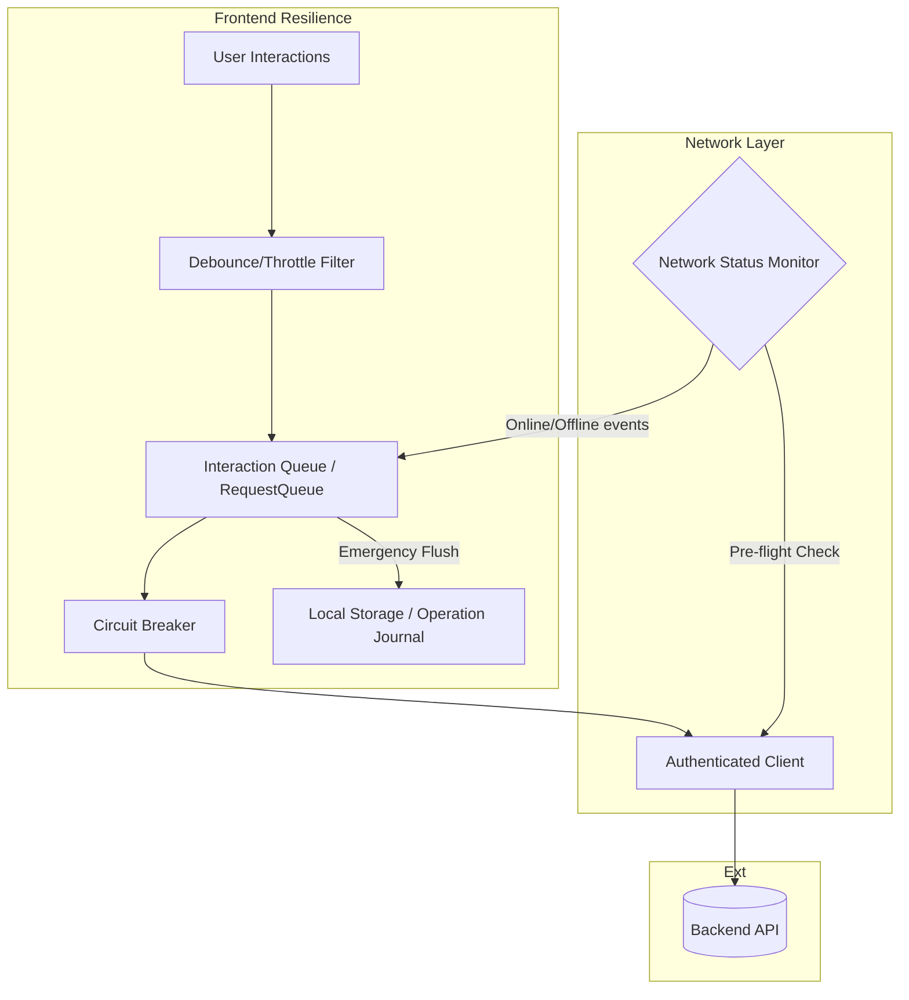

# System Robustness & Network Resilience

**Version**: 1.0  
**Refactored**: 2026-02  

This document consolidates our architectural patterns for building robust, fault-tolerant systems, specifically addressing network resilience, failure handling, and enterprise service level objectives (SLOs).

---

## 🏗️ Resilience Stack Overview

---

## 1. Network Resilience & Stability Architecture

This section details the architectural hardening implemented under **Masterplan Task 1448**. The system is designed to handle flaky internet connectivity, complete service outages, and unexpected application terminations without data loss or UI degradation.

### 1.1 Core Primitives

*   **NetworkStatus Module (`src/utils/NetworkStatus.res`)**: The central authority for connectivity state.
    *   **Hardware Integration**: Monitors `navigator.onLine`.
    *   **Event-Driven**: Dispatches `NetworkStatusChanged(bool)` via `EventBus`.
    *   **Subscription Model**: Allows components to react instantly to connectivity changes.

*   **RequestQueue (`src/utils/RequestQueue.res`)**: Manages backpressure and concurrency.
    *   **Auto-Pause**: Automatically suspends processing when the `NetworkStatus` indicates the browser is offline.
    *   **Resume logic**: Flushes the pending queue immediately upon reconnection.
    *   **Draining**: Provides a safe way to reject all pending tasks during critical system failures.

*   **Circuit Breaker (`src/utils/CircuitBreaker.res`)**: Prevents "cascading failures" by stopping requests to a failing backend.
    *   **Graduated Recovery**: The `HalfOpen` state requires multiple consecutive successes to transition back to `Closed`.
    *   **Failure Tolerance**: Probing in `HalfOpen` mode is resilient to single-request blips.

### 1.2 API Resilience Stack

*   **AuthenticatedClient (`src/systems/Api/AuthenticatedClient.res`)**: Primary gateway.
    *   **Pre-flight Check**: Validates `NetworkStatus.isOnline()` before execution.
    *   **Fast-Fail**: Requests made while offline return immediately, skipping retries.
    *   **Signal Management**: Strict cleanup of `AbortSignal` listeners prevents memory leaks.

*   **Exporter Resilience (`src/systems/Exporter.res`)**: Handles large multi-MB uploads.
    *   **XHR Monitoring**: Uses `XMLHttpRequest` with custom progress tracking.
    *   **Smart Retries**: 3-attempt retry strategy with exponential backoff for non-terminal network errors.

### 1.3 Data Integrity & Recovery

*   **Operation Journal (`src/utils/OperationJournal.res`)**: Tracks long-running async operations.
    *   **Emergency Flush**: On window `beforeunload`, `InProgress` operations serialize to LocalStorage.
    *   **Context Merging**: Incrementally updates metadata so recovery seamlessly resumes.

*   **State Snapshots (`src/core/StateSnapshot.res`)**: Immutable history.
    *   **UUID Stability**: Uses cryptographic `Crypto.randomUUID()` ensuring zero collision during persistence recovery.

### 1.4 Technical Specifications

| Feature | Logic | Timeout / Limit |
| :--- | :--- | :--- |
| **SW Assets** | Cache-First | 15s Timeout |
| **SW Navigation** | Network-First (Fallback to HTML) | 10s Timeout |
| **API Requests** | Circuit Breaker + Pre-check | 30s Timeout |
| **Telemetry** | Batching + Offline Suspend | 5s Batch / 50 logs |
| **Concurrency** | RequestQueue | 6 Concurrent / 256 Queued |

---

## 2. Robustness Patterns & Implementation Strategies

These patterns are language-agnostic guidelines for building fault-tolerant applications.

### 2.1 Interaction Queue (Serialization)
Ensure critical state transitions happen sequentially, preventing race conditions (e.g., scene transitions in 360 viewers, project save/load).
*   **Strategy**: Enqueue asynchronous tasks and process them serially to guarantee state consistency and natural error boundaries.

### 2.2 Optimistic Updates with Rollback
Provide instant UI feedback while maintaining data consistency.
*   **Strategy**: Take a state snapshot, apply the UI update, execute the server action. On error, rollback using the snapshot.

### 2.3 Retry with Exponential Backoff
Automatically retry failed operations with increasing delays and jitter to prevent thundering herds on recovering services.

### 2.4 Rate Limiting & Debouncing/Throttling
Limit API abuse through sliding windows, and debounce UI interactions (like text inputs) to reduce unnecessary computation.

### 2.5 Graceful Degradation & Health Checks
Maintain core functionality when features fail. Use feature flags, fallback content, and offline modes. Monitor Uptime, Response Times (P50/P95), Error Rates, and Throughput proactively.

---

## 3. Enterprise SLO Baseline

Establishes reliability and performance baselines for enterprise-grade operations.

### Correlation Identification Standard
| Field | Type | Description | Propagation |
|-------|------|-------------|-------------|
| `sessionId` | UUID | Unique browser session identifier. Persists until app reload. | `X-Session-ID` Header |
| `operationId` | UUID | Unique logical operation identifier. | `X-Operation-ID` Header |
| `requestId` | UUID | Unique physical request identifier. | `X-Request-ID` Header |

### Service Level Objectives (SLO)
| Flow | SLI (Metric) | Target (SLO) | Error Budget (per month) |
|------|--------------|--------------|--------------------------|
| **Availability** | Success rate of API requests (non-4xx/5xx) | > 99.9% | ~43 mins downtime |
| **Scene Switching** | Latency from click to panorama visible | p95 < 1.5s | 5% exceeding 1.5s |
| **Upload Pipeline** | Image processing + upload success rate | > 98% | 2% failed uploads |
| **Project Persistence** | Save/Load success rate | > 99.99% | ~4 mins downtime |
| **Interaction Stability** | Frontend long tasks (>50ms) per session | < 10 avg | N/A |

### Threshold Contracts (CI Enforcement)
1. **Performance Gate:** PRs increasing p95 Scene Switch latency by >10% trigger flags.
2. **Reliability Gate:** Increase in unhandled exceptions triggers revert.
3. **Correlation Gate:** All new APIs MUST propagate `operationId` and `sessionId`.

---

## 4. E2E Robustness Test Reports

**Date:** 2025-05-22 | **Suite:** `tests/e2e/robustness.spec.ts` | **Status:** Pass (30/30 across Chromium/WebKit)

### Verified Scenarios
- Concurrent Mode Transitions
- Rapid Scene Switching
- Save Button Debouncing & Rapid Saving
- Circuit Breaker Activation
- Optimistic Rollback on API Failure
- Retry with Exponential Backoff
- LoadProject Barrier Blocking
- Interrupted Operation Recovery (Manual state injection verified modal triggering accurately)
