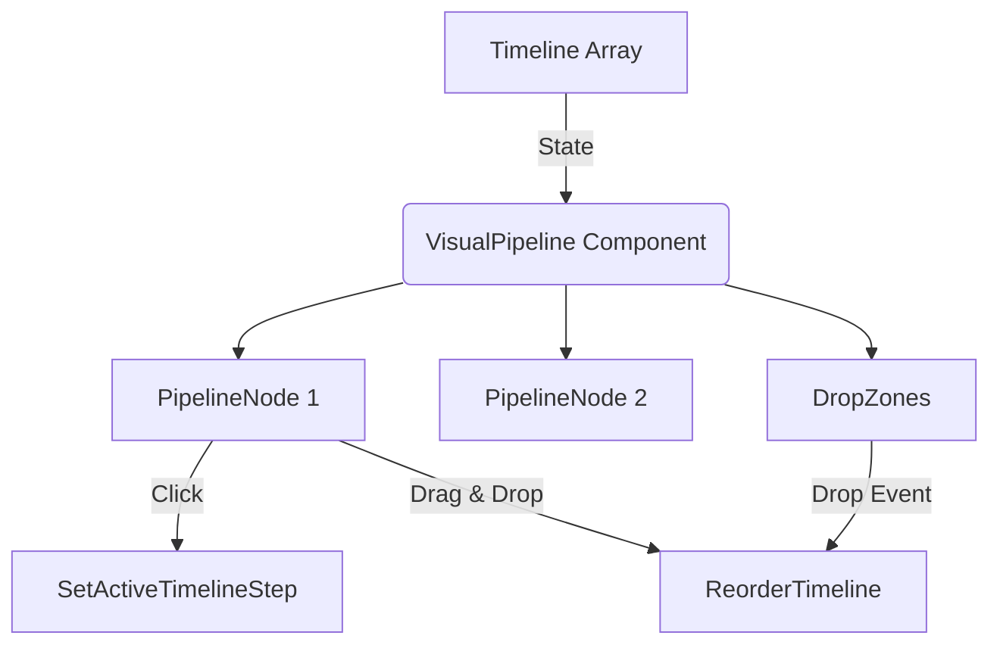

# Visual Pipeline V1 — Design Reference

> **Purpose**: This document captures the exact look, feel, and behavior of the Visual Pipeline V1.

---

## 1. Pipeline Architecture



## 2. Visual Design

### Shape & Layout
- **Shape**: A horizontal chain of **circles** (pipeline nodes) connected by **pipe segments** (drop zones).
- **Position**: Absolute-positioned at the **bottom center** of the viewer builder window.
- **Z-index**: 9000 (above viewer, below modals).
- **Max width**: 1200px. If the chain exceeds this, it **wraps** to a second row with `flex-wrap: wrap` and `row-gap: 18px`.
- **Safe padding**: `padding-left: 70px` (clears floor nav buttons) and `padding-right: 150px` (clears logo).
- **Bottom margin**: `--vp-bottom-margin: 24px` (compact: 12px).
- **Visibility**: Hidden when `timeline` array is empty. Shown as `display: flex` otherwise.

### Node Circles
- **Size**: `--vp-node-base: 18px` (compact: 14px) + 4px = 22px total.
- **Base color**: `var(--primary-ui-blue)` solid fill.
- **Orange stripe**: A horizontal gradient stripe (Golden Minor Ratio 38.2%–61.8%) of `var(--orange-brand)` passes through the center of each node.
- **Active state**: An inner marker circle (`--vp-marker-size: 10px + 4px`) of solid orange scales in via `transform: scale(1)`.

### Pipe Connectors (Drop Zones)
- **Size**: 30px wide × 32px tall by default.
- **Pipe visual**: A `::before` pseudo-element shows a horizontal gradient bar.
- **Drop indicator**: A `::after` pseudo-element shows a 3px × 28px white glowing vertical line.
- **Drag-over state**: Expands to 40px, pipe fades to 30% opacity, insertion line appears.

### Tooltip
- **Trigger**: Hover over any node.
- **Content**: Link ID label, scene thumbnail (tiny file or main file), and scene name.
- **Style**: Dark glass panel (`rgba(15, 23, 42, 0.95)`, `backdrop-filter: blur(4px)`) with 8px border-radius.

### Auto-Forward Indicator
- **When**: Shown if the scene's hotspot for this link has `isAutoForward: Some(true)`.
- **Visual**: A 20px purple circle (`#4B0082`) centered on the node with a white double-chevron icon.

---

## 3. Interaction Model

### Click to Navigate
- First node is always home scene (index `0`); the remaining nodes represent link destinations.
- Clicking a node activates timeline context (if applicable) and routes through `NavigationSupervisor.requestNavigation` (same path as sidebar scene click).
- Destination resolution uses hotspot `targetSceneId`, then timeline `targetScene`, and finally source scene fallback.

### Drag and Drop (Scene Reordering)
- **Mechanism**: HTML5 Drag and Drop API.
- **Drag start**: Sets `effectAllowed: "move"`, stores item ID. Uses transparent 1×1 canvas as drag image.
- **Drop zones**: `DropZone` components handle reorder logic using `Logic.calculateReorder()`.

---

## 4. Data Model

### Timeline Items
```rescript
type timelineItem = {
  id: string,
  linkId: string,
  sceneId: string,
  targetScene: string,
  transition: string,
  duration: int,
}
```
- Appends to `state.timeline`.
- Each item maps to a hotspot link (`linkId`) on a specific scene (`sceneId`).

---

## 5. Component Architecture

### Sub-Components
| Component | Purpose |
|---|---|
| `DropZone` | Invisible gap between nodes; handles drag-over/drop events and shows insertion indicator |
| `PipelineNode` | Individual circle node; handles click, drag start/end, context menu; shows tooltip |

### State Selectors
- `AppContext.usePipelineSlice()` — Returns `{ scenes, timeline, activeIndex, activeTimelineStepId }`.
- `AppContext.useAppDispatch()` — Dispatch function.
