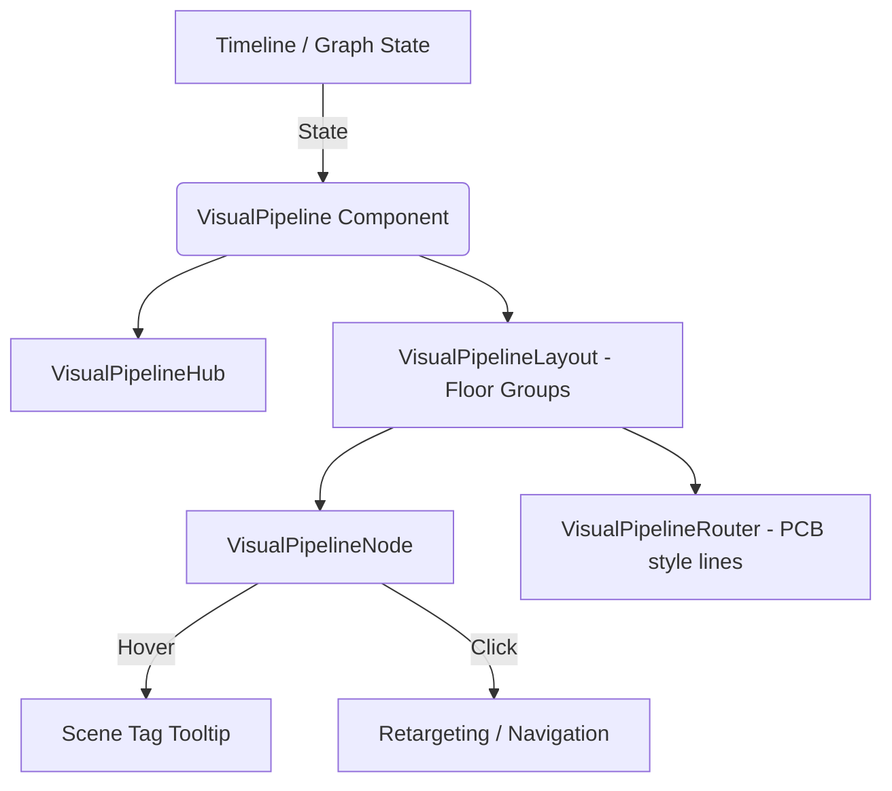

# Visual Pipeline — Design Reference

> **Purpose**: This document captures the exact look, feel, and behavior of the Visual Pipeline, currently iterated to **V3 (Floor-Grouped Squares & PCB-style Routing)**.

---

## 1. Pipeline Architecture

## 2. Visual Design

### Shape & Layout
- **Shape**: A structure of **floor-grouped squares** connected by deterministic **PCB-style lines** rather than chaotic drop-zones or floating circles.
- **Grouping**: Segments are broken down intuitively by floor. Isolated floors show a home button.
- **Position**: Absolute-positioned at the **bottom center** of the viewer builder window.
- **Z-index**: 9000 (above viewer, below modals).
- **Flexibility**: Handles complex architectures via `flex-wrap` while maintaining clear pathing.

### Node Squares
- **Size**: Scalable squares (e.g. replacing prior 22px circles/thumbnail nodes) to provide optimal hitboxes and clean aesthetics.
- **Auto-Forward Indicator**: Auto-forward hotspots and pipeline squares are highlighted in **Emerald** (or Indigo) to distinguish them from standard traversal items. 
- **Active State**: The active node receives a yellow sync highlight and scales up slightly to denote current presence. Active hovers remove shadows for a flat, modern design.

### PCB-Style Connectors
- **Routing**: Instead of standard gradients, routing logic explicitly draws deterministic PCB-style lines (`VisualPipelineRouter.res`) connecting nodes across and within floors.

### Tooltip
- **Trigger**: Hover over any node (600ms delay).
- **Content**: Displays the **Scene Tag Name** and high-quality room preview thumbnail (instead of a generic Link ID or UUID). Text is properly truncated and compact.
- **Style**: Dark glass panel (`rgba(15, 23, 42, 0.95)`, `backdrop-filter: blur(4px)`) with an orange border and navy footer.

---

## 3. Interaction Model

### Click to Navigate
- First node is typically the hub/home scene.
- Pressing a node triggers `NavigationSupervisor.requestNavigation` or direct retargeting shortcuts.
- Clicking an inactive path activates it safely via a unified canonical traversal sequence.

### Hover
- Hovering an item previews the destination room, dimming the current viewport slightly for distinct focus (Room-label preview dim).

---

## 4. Component Architecture

### Sub-Components
| Component | Purpose |
|---|---|
| `VisualPipelineLayout` | Orchestrates the responsive placement of floor rows |
| `VisualPipelineRouter` | Draws the deterministic mathematical lines (PCB paths) |
| `VisualPipelineNode` | Individual square node; handles click, hover logic, styles |
| `VisualPipelineHub` | Hub node integration and visual representation |

### State Selectors
- Uses app slice contexts combined with Canonical Traversal logic (`CanonicalTraversal.res`) which unifies sequence generation across the builder and exported tours.
