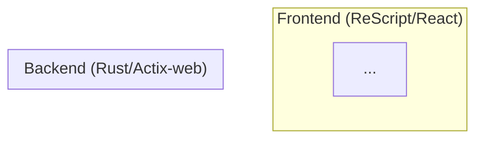

# [1341] Create System Architecture Diagram

## Priority: P2 (Medium)

## Context
`docs/ARCHITECTURE.md` has a placeholder:
```markdown
## 🏗️ System Architecture
*(To be populated with overall system diagram)*
```

For a project with this level of documentation maturity (`MAP.md`, `DATA_FLOW.md`, `PROJECT_SPECS.md`), the missing system architecture diagram is a significant gap.

## Objective
Create a Mermaid diagram in `docs/ARCHITECTURE.md` showing the full system architecture.

## Required Diagram Content

### 1. High-Level System Diagram
Show the three tiers:
- **Frontend** (ReScript/React) → API Layer → **Backend** (Rust/Actix-web)
- Include IndexedDB for local persistence
- Include the Pannellum viewer integration

### 2. Frontend Architecture
- **State Flow**: Actions → Reducer → State → Components (Elm/Redux pattern)
- **Core**: Types, State, Reducer, Actions
- **Systems**: Navigation, Upload, Simulation, Teaser, ProjectManager
- **Components**: Sidebar, ViewerUI, SceneList, HotspotLayer
- **Infrastructure**: EventBus, Logger, InteractionGuard, PersistenceLayer

### 3. Data Flow Overlay
- **Upload Pipeline**: Files → Resizer → API → Backend Image Processing
- **Persistence**: State → PersistenceLayer → IndexedDB
- **Navigation**: User Click → FSM → SceneLoader → ViewerPool → SceneTransition

### 4. Backend Architecture
- **API Layer**: Actix-web handlers (project, media, pathfinder)
- **Services**: Upload quota, geocoding, image analysis
- **Storage**: File system for images, JSON for project data

## Format
Use Mermaid.js syntax so the diagram renders natively in GitHub:

```markdown
## 🏗️ System Architecture



## Verification
- [ ] Diagram renders correctly on GitHub
- [ ] All major modules represented
- [ ] Data flow arrows are accurate
- [ ] Placeholder text removed from `docs/ARCHITECTURE.md`

## Estimated Effort: Half day
